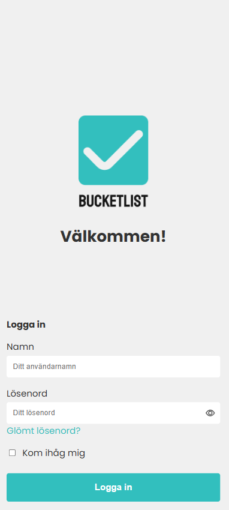
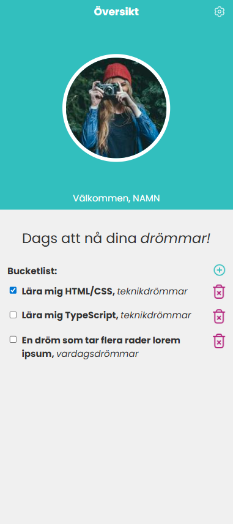
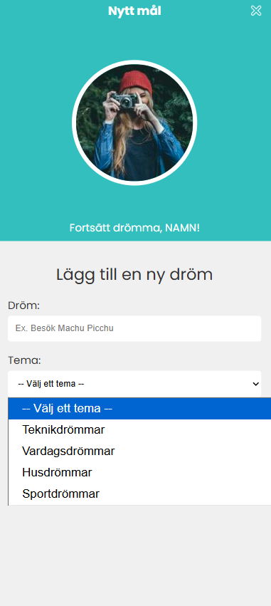
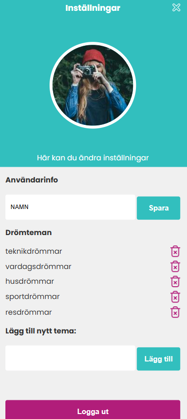

# Bucket List

## Overview

This project is a frontend Typescript exercise focused on DOM manipulation and interactive UI development. Based on a pre-designed HTML & CSS template, **Bucket List** allows users to create and organise their personal goals and dreams.

<table>
    <tr>
        <td width="25%" valign="top">
            <i>Login:</i><br>
            
        </td>
        <td width="25%" valign="top">
            <i>Dashboard:</i><br>
            
        </td>
        <td width="25%" valign="top">
            <i>Add dream:</i><br>
            
        </td>
        <td width="25%" valign="top">
            <i>Settings:</i><br>
            
        </td>
    </tr>
</table>

## Technologies Used

- Typescript
  - event handling & DOM manipulation
  - form validation
  - dynamic rendering
- HTML5
- CSS3

## How to Run

1. Clone this repository:

```bash
git clone https://github.com/jplimmer/bucket-list.git
```

2. Install packages (typescript) and compile:

```bash
npm install
npx tsc
```

3. Open `index.html` in your browser.

## Project Structure

```
├── assets/
│   └── icons/
│       └── (icon assets)
├── pages/
│   ├── add-dream.html
│   ├── dashboard.html
│   ├── index.html
│   ├── login.html
│   └── settings.html
├── src/
│   ├── constants/
│   ├── models/
│   ├── pages/
│   ├── services/
│   ├── ui/
│   └── utils/
├── styles/
│   └── (css styles)
├── .gitignore
├── tsconfig.json
└── README.md (this file)
```
